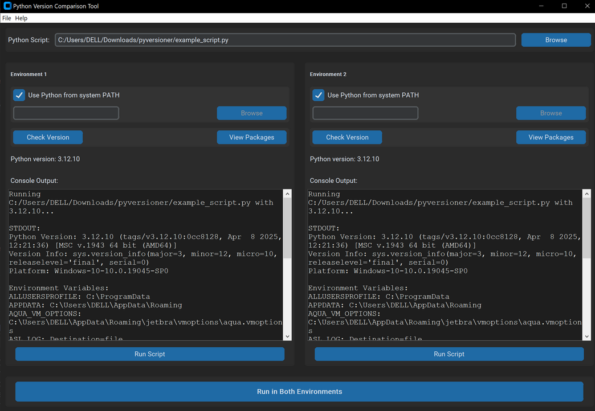

# PyVersioner

Simple tool to compare Python code execution across different Python environments.



## Features

- Compare execution of Python scripts in two different Python environments
- View output and execution time for each environment
- Compare installed packages between environments

## Installation

(You can check out the releases for standalone .exe)

1. Install the required dependencies:
   ```bash
   pip install -r requirements.txt
   ```

2. Run the application:
   ```bash
   python pyversioner.py
   ```

## Usage

1. Launch the application
2. Select a Python script by clicking "Browse"
3. Configure both Python environments by clicking "Select Path" for each
4. Click "Run" in each environment or "Run in Both Environments" to execute the script
5. View the results in the output boxes

## License

This project is licensed under the MIT License - see the LICENSE file for details.
